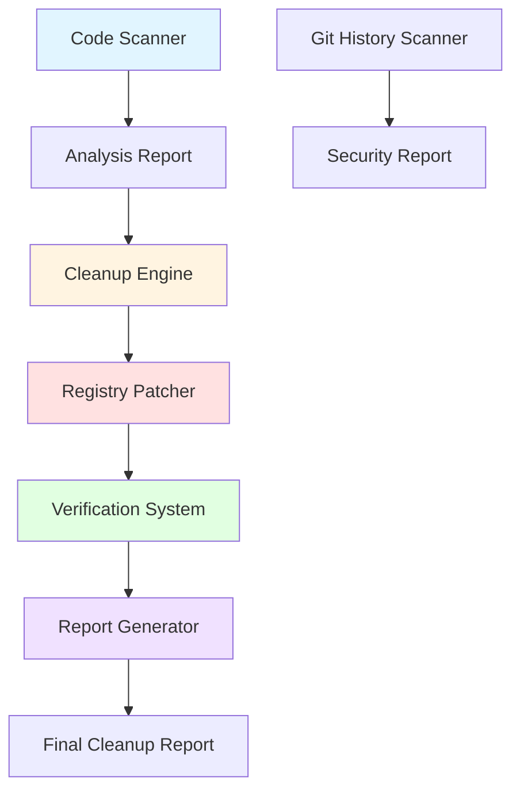

# Design Document: API Cleanup System

## Overview

The API Cleanup System is a comprehensive solution for identifying, removing, and verifying unused API integrations in the codebase. The system addresses three critical issues:

1. **Unused API Credentials**: Finance API and News API environment variables exist but are never referenced in code
2. **Incomplete Integration**: Weather API has partial configuration but no working implementation
3. **Critical Bug**: API Registry's `loadConfigurations()` method calls undefined `_loadFreeAPIs()` method

The design follows a safe, automated approach with verification at each step to prevent breaking existing functionality. The system will scan the codebase, identify unused resources, remove them systematically, fix the registry bug, and verify runtime integrity.

### Design Goals

- Automate detection of unused API keys and code references
- Safely remove unused environment variables and code files
- Fix API Registry initialization to properly load free APIs
- Verify application functionality after cleanup
- Generate comprehensive reports documenting all changes
- Scan git history for exposed secrets
- Preserve all active integrations (Judge0, OpenRouter, Redis, RabbitMQ, MongoDB, Free APIs)

## Architecture

The API Cleanup System consists of five main components working in sequence:



### Component Responsibilities

1. **Code Scanner**: Static analysis tool that scans environment files and JavaScript code to identify unused API keys and references
2. **Cleanup Engine**: Orchestrates removal of unused environment variables, code files, and imports
3. **Registry Patcher**: Fixes the API Registry initialization bug by implementing the missing method
4. **Verification System**: Executes runtime tests to ensure application integrity after cleanup
5. **Report Generator**: Creates comprehensive before/after documentation
6. **Git History Scanner**: Searches commit history for exposed secrets (independent component)

## Components and Interfaces

### 1. Code Scanner

The Code Scanner performs static analysis to identify unused API integrations.

#### Scanner Interface

```javascript
class CodeScanner {
  /**
   * Scan environment files for API key declarations
   * @returns {Promise<Array<EnvVariable>>}
   */
  async scanEnvironmentFiles()

  /**
   * Search JavaScript files for API key references
   * @param {string} envVarName - Environment variable name
   * @returns {Promise<Array<CodeReference>>}
   */
  async findCodeReferences(envVarName)

  /**
   * Identify unused API keys
   * @returns {Promise<ScanResult>}
   */
  async identifyUnusedAPIs()

  /**
   * Scan route definitions and controllers
   * @returns {Promise<RouteAnalysis>}
   */
  async analyzeRoutes()

  /**
   * Generate analysis report
   * @returns {Promise<AnalysisReport>}
   */
  async generateReport()
}
```

#### Data Structures

```javascript
// Environment variable representation
interface EnvVariable {
  name: string;           // e.g., "WEATHER_API_KEY"
  value: string;          // e.g., "your-weather-api-key"
  file: string;           // e.g., ".env.example"
  lineNumber: number;     // Line in file
  relatedVars: string[];  // e.g., ["WEATHER_API_BASE_URL", "WEATHER_API_TIMEOUT"]
}

// Code reference location
interface CodeReference {
  file: string;           // File path
  lineNumber: number;     // Line number
  context: string;        // Surrounding code
  type: 'import' | 'usage' | 'config';
}

// Scan result
interface ScanResult {
  unusedAPIs: Array<{
    name: string;         // e.g., "Finance API"
    envVars: EnvVariable[];
    codeFiles: string[];  // Files to remove
    reason: string;       // Why it's unused
  }>;
  activeAPIs: Array<{
    name: string;
    envVars: EnvVariable[];
    references: CodeReference[];
  }>;
  incompleteAPIs: Array<{
    name: string;
    envVars: EnvVariable[];
    missingComponents: string[];
  }>;
}
```

#### Scanning Strategy

The scanner uses multiple techniques:

1. **Environment File Parsing**: Parse `.env` and `.env.example` using regex patterns to extract API key declarations
2. **AST Analysis**: Use `@babel/parser` to parse JavaScript files and extract import statements and variable references
3. **Grep Search**: Use ripgrep for fast text-based searching across the codebase
4. **Pattern Matching**: Identify API-related patterns (e.g., `process.env.WEATHER_API_KEY`, `FINANCE_API_KEY`)

**Implementation Approach**:
- Scan `.env.example` first to get the canonical list of environment variables
- For each API-related env var, search all `.js` files in `src/` directory
- Track both direct references (`process.env.WEATHER_API_KEY`) and indirect references (imported from config)
- Group related variables by prefix (e.g., all `WEATHER_API_*` variables belong together)

### 2. Cleanup Engine

The Cleanup Engine orchestrates the removal process with safety checks.

#### Cleanup Interface

```javascript
class CleanupEngine {
  /**
   * Remove unused environment variables
   * @param {Array<string>} varNames - Variables to remove
   * @returns {Promise<CleanupResult>}
   */
  async removeEnvironmentVariables(varNames)

  /**
   * Remove code files
   * @param {Array<string>} filePaths - Files to delete
   * @returns {Promise<CleanupResult>}
   */
  async removeCodeFiles(filePaths)

  /**
   * Remove unused imports and references
   * @param {Array<CodeReference>} references - References to remove
   * @returns {Promise<CleanupResult>}
   */
  async removeCodeReferences(references)

  /**
   * Update API Registry validation
   * @param {Array<string>} categoriesToRemove - Unused categories
   * @returns {Promise<CleanupResult>}
   */
  async updateRegistryValidation(categoriesToRemove)

  /**
   * Execute full cleanup workflow
   * @param {ScanResult} scanResult - Results from scanner
   * @returns {Promise<FullCleanupResult>}
   */
  async executeCleanup(scanResult)
}
```

#### Cleanup Strategy

**Environment Variable Removal**:
- Parse `.env` and `.env.example` line by line
- Preserve comments and blank lines for readability
- Remove entire configuration blocks (all related variables for an API)
- Maintain alphabetical or logical grouping of remaining variables
- Write updated content atomically to prevent corruption

**Code File Removal**:
- Delete `src/lib/publicApi/clients/weatherClient.js`
- Remove any test files associated with unused APIs
- Update import statements in files that referenced deleted modules

**Code Reference Removal**:
- Remove unused methods from `publicApiService.js` (`getWeather`, `getForecast`)
- Remove unused switch cases from client factory
- Remove unused imports after method removal
- Use AST-based code modification to ensure syntactic correctness

**Registry Validation Update**:
- Remove 'weather', 'finance', 'news' from `validCategories` array in `apiRegistry.js`
- Keep only categories that have active APIs: 'animals', 'books', 'science', 'utility'

### 3. Registry Patcher

The Registry Patcher fixes the critical initialization bug.

#### Patcher Interface

```javascript
class RegistryPatcher {
  /**
   * Analyze the API Registry for bugs
   * @returns {Promise<BugAnalysis>}
   */
  async analyzeBug()

  /**
   * Fix the loadConfigurations method
   * @returns {Promise<PatchResult>}
   */
  async patchLoadConfigurations()

  /**
   * Verify the fix works
   * @returns {Promise<VerificationResult>}
   */
  async verifyFix()
}
```

#### Bug Analysis

**Current Issue**:
```javascript
// In apiRegistry.js constructor
constructor() {
  this.apis = new Map();
  this.loadConfigurations(); // ❌ This method is called but not defined
}
```

**Root Cause**: The `loadConfigurations()` method is declared in a comment but never implemented. The `_loadFreeAPIs()` method exists and contains all the free API registrations, but it's never called.

**Fix Strategy**:
```javascript
// Add this method to APIRegistry class
loadConfigurations() {
  logger.info('Loading API configurations...');
  this._loadFreeAPIs();
  logger.info(`Loaded ${this.apis.size} API configurations`);
}
```

**Implementation Details**:
- Insert the method definition after the constructor
- Use AST-based code editing to ensure proper placement
- Maintain existing code style and indentation
- Add logging for observability

### 4. Verification System

The Verification System ensures the application works correctly after cleanup.

#### Verification Interface

```javascript
class VerificationSystem {
  /**
   * Verify application startup
   * @returns {Promise<StartupResult>}
   */
  async verifyStartup()

  /**
   * Verify API Registry initialization
   * @returns {Promise<RegistryResult>}
   */
  async verifyRegistryInitialization()

  /**
   * Verify route handlers
   * @returns {Promise<RouteResult>}
   */
  async verifyRoutes()

  /**
   * Verify database connections
   * @returns {Promise<DatabaseResult>}
   */
  async verifyDatabaseConnections()

  /**
   * Run full verification suite
   * @returns {Promise<VerificationReport>}
   */
  async runFullVerification()
}
```

#### Verification Strategy

**Startup Verification**:
- Import and instantiate the main application module
- Catch any import errors or initialization failures
- Verify no undefined method errors occur
- Check that all required services initialize

**Registry Verification**:
- Import `apiRegistry` singleton
- Verify `apis` Map is populated
- Check that all 6 free APIs are registered (dog-ceo, cat-facts, poetrydb, gutendex, nasa-apod, numbers-api)
- Verify no errors in console logs

**Route Verification**:
- Load all route definitions
- Verify each route has a corresponding controller method
- Check that removed routes (weather endpoints) are no longer present
- Verify remaining routes are accessible

**Database Verification**:
- Test MongoDB connection
- Test Redis connection
- Test RabbitMQ connection
- Verify all connections succeed without errors

**Test Execution**:
- Run existing Jest test suite
- Verify all tests pass
- Check for any new failures introduced by cleanup

### 5. Report Generator

The Report Generator creates comprehensive documentation of all changes.

#### Report Interface

```javascript
class ReportGenerator {
  /**
   * Generate before/after summary
   * @param {ScanResult} before - State before cleanup
   * @param {CleanupResult} changes - Changes made
   * @returns {Promise<Report>}
   */
  async generateSummary(before, changes)

  /**
   * Document removed resources
   * @param {CleanupResult} result - Cleanup results
   * @returns {Promise<RemovalReport>}
   */
  async documentRemovals(result)

  /**
   * Document preserved resources
   * @param {ScanResult} scanResult - Scan results
   * @returns {Promise<PreservationReport>}
   */
  async documentPreserved(scanResult)

  /**
   * Generate migration notes
   * @returns {Promise<MigrationNotes>}
   */
  async generateMigrationNotes()

  /**
   * Create final report
   * @returns {Promise<string>} - Path to report file
   */
  async createFinalReport()
}
```

#### Report Structure

```markdown
# API Cleanup Report

## Executive Summary
- Total APIs removed: X
- Total environment variables removed: Y
- Total files deleted: Z
- Total lines of code removed: N
- Bugs fixed: 1 (API Registry initialization)

## Removed Resources

### Environment Variables
- WEATHER_API_KEY
- WEATHER_API_BASE_URL
- WEATHER_API_TIMEOUT
- WEATHER_API_CACHE_TTL
- WEATHER_API_RATE_LIMIT_MAX
- WEATHER_API_RATE_LIMIT_WINDOW
- FINANCE_API_KEY
- FINANCE_API_BASE_URL
- ... (full list)

### Deleted Files
- src/lib/publicApi/clients/weatherClient.js

### Modified Files
- .env.example (removed 18 lines)
- src/lib/publicApi/apiRegistry.js (added loadConfigurations method, removed categories)
- src/services/publicApiService.js (removed getWeather, getForecast methods)

## Preserved Resources

### Active API Integrations
- Judge0 (RAPIDAPI_KEY, JUDGE0_API_URL)
- OpenRouter AI (OPENROUTER_API_KEY, OPENROUTER_BASE_URL, OPENROUTER_MODEL)
- Redis (REDIS_HOST, REDIS_PORT, REDIS_PASSWORD)
- RabbitMQ (RABBITMQ_URL)
- MongoDB (MONGODB_URI)
- JWT Authentication (JWT_SECRET)
- Free APIs (dog-ceo, cat-facts, poetrydb, gutendex, nasa-apod, numbers-api)

## Bug Fixes

### API Registry Initialization
**Issue**: loadConfigurations() method called but not defined
**Fix**: Implemented loadConfigurations() to call _loadFreeAPIs()
**Impact**: API Registry now properly initializes all free APIs on startup

## Verification Results
- ✅ Application startup successful
- ✅ API Registry loaded 6 free APIs
- ✅ All routes accessible
- ✅ Database connections functional
- ✅ Test suite passed (X/X tests)

## Migration Notes
No breaking changes. All active integrations preserved.
```

### 6. Git History Scanner

The Git History Scanner searches for exposed secrets in commit history.

#### Scanner Interface

```javascript
class GitHistoryScanner {
  /**
   * Search git history for API key patterns
   * @returns {Promise<Array<SecretExposure>>}
   */
  async scanHistory()

  /**
   * Check for common secret patterns
   * @returns {Promise<Array<SecretPattern>>}
   */
  async detectSecretPatterns()

  /**
   * Generate security report
   * @returns {Promise<SecurityReport>}
   */
  async generateSecurityReport()
}
```

#### Scanning Strategy

**Git Log Analysis**:
- Use `git log -p` to get full patch history
- Search for patterns matching API keys (long alphanumeric strings, keys starting with "sk-")
- Identify commits that added or modified `.env` files
- Track when secrets were added and if they were later removed

**Pattern Detection**:
```javascript
const secretPatterns = [
  /sk-[a-zA-Z0-9]{32,}/g,           // OpenAI-style keys
  /[a-zA-Z0-9]{32,}/g,               // Generic long strings
  /"[A-Z_]+_API_KEY"\s*:\s*"[^"]+"/g, // API keys in JSON
  /process\.env\.[A-Z_]+_KEY/g       // Environment variable references
];
```

**Security Report**:
- List all commits where secrets were found
- Provide commit hash, date, author, and file path
- Recommend remediation steps (git-filter-repo, key rotation)
- Distinguish between example values and real secrets

## Data Models

### Environment Configuration

```javascript
// Represents the structure of environment files
class EnvironmentConfig {
  constructor() {
    this.variables = new Map(); // name -> EnvVariable
    this.comments = [];         // Preserved comments
    this.sections = [];         // Logical groupings
  }

  addVariable(name, value, lineNumber) {
    this.variables.set(name, { name, value, lineNumber });
  }

  removeVariable(name) {
    this.variables.delete(name);
  }

  toString() {
    // Serialize back to .env format
  }
}
```

### API Integration

```javascript
// Represents an API integration in the system
class APIIntegration {
  constructor(name, category, envVars, codeFiles, status) {
    this.name = name;           // e.g., "Weather API"
    this.category = category;   // e.g., "weather"
    this.envVars = envVars;     // Array of environment variable names
    this.codeFiles = codeFiles; // Array of file paths
    this.status = status;       // 'active' | 'unused' | 'incomplete'
  }

  isActive() {
    return this.status === 'active';
  }

  isRemovable() {
    return this.status === 'unused' || this.status === 'incomplete';
  }
}
```

### Cleanup Result

```javascript
// Tracks the results of cleanup operations
class CleanupResult {
  constructor() {
    this.removedEnvVars = [];    // Array of variable names
    this.removedFiles = [];      // Array of file paths
    this.modifiedFiles = [];     // Array of { path, changes }
    this.errors = [];            // Array of error messages
    this.warnings = [];          // Array of warning messages
  }

  addRemoval(type, item) {
    if (type === 'env') this.removedEnvVars.push(item);
    if (type === 'file') this.removedFiles.push(item);
  }

  addModification(filePath, changes) {
    this.modifiedFiles.push({ path: filePath, changes });
  }

  hasErrors() {
    return this.errors.length > 0;
  }
}
```


## Correctness Properties

*A property is a characteristic or behavior that should hold true across all valid executions of a system—essentially, a formal statement about what the system should do. Properties serve as the bridge between human-readable specifications and machine-verifiable correctness guarantees.*

### Property 1: Environment File Scanning Completeness

*For any* environment file (.env or .env.example) containing API key declarations, the Code Scanner should identify and extract all API key variable names and their associated configuration variables.

**Validates: Requirements 1.1**

### Property 2: Code Reference Detection

*For any* API key environment variable name, the Code Scanner should find all references to that variable in JavaScript files, including direct references (process.env.VAR_NAME) and indirect references (imported from config modules).

**Validates: Requirements 1.2**

### Property 3: Unused API Classification

*For any* API key that has zero code references in the JavaScript codebase, the Code Scanner should classify it as unused, and for any API key with code references, it should classify it as active or incomplete based on implementation completeness.

**Validates: Requirements 1.3, 1.5**

### Property 4: Route-Controller Correspondence

*For any* route definition in the routes directory, the Code Scanner should verify whether a corresponding controller method exists, and for any controller method, should verify whether it is called by at least one route.

**Validates: Requirements 2.2, 2.3, 2.4**

### Property 5: Environment Variable Removal Preservation

*For any* environment file, when removing a set of unused variables, all comments, blank lines, and formatting should be preserved, and the file should remain syntactically valid.

**Validates: Requirements 3.3**

### Property 6: Configuration Block Removal

*For any* API with multiple related environment variables (e.g., API_KEY, API_BASE_URL, API_TIMEOUT), when removing that API, all related variables should be removed together as a complete block.

**Validates: Requirements 3.4**

### Property 7: Active API Preservation

*For any* API integration classified as active (Judge0, OpenRouter, Redis, RabbitMQ, MongoDB, JWT, Free APIs), all associated environment variables, code files, and references should remain unchanged after cleanup.

**Validates: Requirements 4.4, 8.1, 8.2, 8.3, 8.4, 8.5, 8.6, 8.7**

### Property 8: Import Cleanup After Code Removal

*For any* JavaScript file where methods or classes are removed, all import statements that are no longer referenced should also be removed, and the file should remain syntactically valid.

**Validates: Requirements 4.3**

### Property 9: Registry Initialization Success

*For any* instantiation of the API Registry, the constructor should complete without throwing errors, and the apis Map should contain all free API configurations (minimum 6 APIs).

**Validates: Requirements 5.2, 5.5**

### Property 10: Registry Reload Idempotence

*For any* API Registry instance, calling reloadConfigurations() should result in the same set of registered APIs as the initial load, demonstrating that reload is idempotent.

**Validates: Requirements 5.4**

### Property 11: Verification Error Reporting

*For any* runtime error that occurs during verification, the error report should include the error message, file location, and stack trace.

**Validates: Requirements 6.4**

### Property 12: Cleanup Report Completeness

*For any* cleanup operation, the generated report should contain all removed environment variables, all deleted files with full paths, all modified files with change summaries, and all remaining API integrations with their status.

**Validates: Requirements 7.1, 7.2, 7.3, 7.4, 7.6**

### Property 13: Git History Pattern Detection

*For any* commit in git history containing strings matching secret patterns (sk-*, long alphanumeric strings, API_KEY assignments), the scanner should detect and report the commit hash, file path, and matched pattern.

**Validates: Requirements 9.1, 9.2, 9.3**

### Property 14: Security Report Recommendations

*For any* security scan that finds secrets in git history, the generated report should include recommendations for remediation (git-filter-repo or BFG Repo-Cleaner).

**Validates: Requirements 9.5**

### Property 15: Post-Cleanup Reference Absence

*For any* API that is removed during cleanup, searching the entire codebase after cleanup should return zero references to that API's identifier strings.

**Validates: Requirements 10.5**

## Error Handling

The API Cleanup System must handle errors gracefully at each stage to prevent data loss and maintain system integrity.

### Scanner Error Handling

**File Access Errors**:
- If environment files cannot be read, log error and continue with available files
- If JavaScript files cannot be parsed, log error and mark file for manual review
- Never fail entire scan due to single file error

**Parse Errors**:
- If AST parsing fails, fall back to regex-based text search
- Log parse errors with file path and line number
- Continue scanning remaining files

**Git History Errors**:
- If git is not available, skip history scanning and note in report
- If git log fails, report error but continue with other cleanup tasks
- Handle large repositories by limiting history depth

### Cleanup Error Handling

**File Modification Errors**:
- Create backups before modifying any files
- If file write fails, restore from backup and log error
- Use atomic writes to prevent partial updates
- Validate file syntax after modification

**Code Removal Errors**:
- If AST-based removal fails, fall back to manual removal with user confirmation
- Verify code remains syntactically valid after each removal
- If syntax errors are introduced, rollback the change

**Rollback Strategy**:
```javascript
class CleanupTransaction {
  constructor() {
    this.backups = new Map(); // file path -> original content
    this.operations = [];     // list of operations performed
  }

  async backup(filePath) {
    const content = await fs.readFile(filePath, 'utf8');
    this.backups.set(filePath, content);
  }

  async rollback() {
    for (const [filePath, content] of this.backups) {
      await fs.writeFile(filePath, content, 'utf8');
    }
    logger.info('Rolled back all changes');
  }

  async commit() {
    this.backups.clear();
    logger.info('Committed all changes');
  }
}
```

### Verification Error Handling

**Startup Failures**:
- If application fails to start, immediately rollback all changes
- Capture full error stack trace
- Report which component failed to initialize

**Test Failures**:
- If tests fail after cleanup, mark as verification failure
- Do not automatically rollback (tests may have been failing before)
- Report which tests failed and provide diff

**Database Connection Errors**:
- Distinguish between connection errors and cleanup-related errors
- If database was working before cleanup and fails after, rollback
- If database was already failing, note in report but don't rollback

### Error Recovery

**Partial Cleanup State**:
- If cleanup is interrupted, detect partial state on next run
- Offer to complete cleanup or rollback to original state
- Never leave system in inconsistent state

**Validation Failures**:
- If post-cleanup validation fails, provide detailed error report
- Offer automatic rollback or manual intervention
- Log all validation failures for debugging

## Testing Strategy

The API Cleanup System will use a dual testing approach combining unit tests for specific scenarios and property-based tests for comprehensive coverage.

### Unit Testing

Unit tests will focus on specific examples, edge cases, and integration points:

**Scanner Unit Tests**:
- Test parsing of well-formed environment files
- Test handling of malformed environment files (missing values, invalid syntax)
- Test detection of various API key reference patterns
- Test handling of files with no API references
- Test route-controller matching with missing controllers
- Test git history scanning with known commit patterns

**Cleanup Unit Tests**:
- Test removal of specific environment variables (Weather API example)
- Test preservation of specific active APIs (Judge0, OpenRouter examples)
- Test file deletion for specific client files
- Test method removal from service files
- Test import cleanup after method removal
- Test category removal from validation arrays

**Registry Unit Tests**:
- Test that loadConfigurations() method exists and is callable
- Test that _loadFreeAPIs() is called during initialization
- Test that all 6 free APIs are registered after initialization
- Test that reloadConfigurations() clears and reloads APIs

**Verification Unit Tests**:
- Test startup verification with successful initialization
- Test startup verification with initialization failure
- Test route verification with all routes accessible
- Test database connection verification

**Report Unit Tests**:
- Test report generation with known cleanup results
- Test report formatting and structure
- Test migration notes generation

### Property-Based Testing

Property-based tests will verify universal properties across randomized inputs using the `fast-check` library for JavaScript. Each test will run a minimum of 100 iterations.

**Configuration**:
```javascript
import fc from 'fast-check';

// Configure all property tests to run 100+ iterations
const propertyConfig = { numRuns: 100 };
```

**Property Test 1: Environment File Scanning**
```javascript
// Feature: api-cleanup, Property 1: Environment file scanning completeness
fc.assert(
  fc.property(
    fc.array(fc.record({
      name: fc.string().filter(s => s.match(/^[A-Z_]+$/)),
      value: fc.string()
    })),
    (envVars) => {
      const fileContent = envVars.map(v => `${v.name}="${v.value}"`).join('\n');
      const scanner = new CodeScanner();
      const result = scanner.parseEnvironmentFile(fileContent);
      
      // All variables should be found
      return envVars.every(v => 
        result.variables.some(r => r.name === v.name)
      );
    }
  ),
  propertyConfig
);
```

**Property Test 2: Code Reference Detection**
```javascript
// Feature: api-cleanup, Property 2: Code reference detection
fc.assert(
  fc.property(
    fc.string().filter(s => s.match(/^[A-Z_]+$/)),
    fc.nat(10),
    (varName, refCount) => {
      // Generate code with known number of references
      const codeFiles = generateCodeWithReferences(varName, refCount);
      const scanner = new CodeScanner();
      const references = scanner.findCodeReferences(varName, codeFiles);
      
      // Should find exactly the number of references we created
      return references.length === refCount;
    }
  ),
  propertyConfig
);
```

**Property Test 3: Unused API Classification**
```javascript
// Feature: api-cleanup, Property 3: Unused API classification
fc.assert(
  fc.property(
    fc.array(fc.record({
      apiName: fc.string(),
      hasReferences: fc.boolean()
    })),
    (apis) => {
      const scanner = new CodeScanner();
      const results = scanner.classifyAPIs(apis);
      
      // APIs with no references should be marked unused
      return apis.every(api => {
        const result = results.find(r => r.name === api.apiName);
        return api.hasReferences ? 
          result.status !== 'unused' : 
          result.status === 'unused';
      });
    }
  ),
  propertyConfig
);
```

**Property Test 4: Environment Variable Removal Preservation**
```javascript
// Feature: api-cleanup, Property 5: Environment variable removal preservation
fc.assert(
  fc.property(
    fc.array(fc.string()), // comments
    fc.array(fc.record({ name: fc.string(), value: fc.string() })), // vars
    fc.array(fc.nat()), // indices to remove
    (comments, vars, removeIndices) => {
      const fileContent = buildEnvFile(comments, vars);
      const cleanup = new CleanupEngine();
      const varsToRemove = removeIndices.map(i => vars[i % vars.length]?.name).filter(Boolean);
      const result = cleanup.removeEnvironmentVariables(fileContent, varsToRemove);
      
      // All original comments should still be present
      return comments.every(comment => result.includes(comment));
    }
  ),
  propertyConfig
);
```

**Property Test 5: Configuration Block Removal**
```javascript
// Feature: api-cleanup, Property 6: Configuration block removal
fc.assert(
  fc.property(
    fc.array(fc.record({
      prefix: fc.string(),
      suffixes: fc.array(fc.string())
    })),
    (apiConfigs) => {
      const envVars = apiConfigs.flatMap(api => 
        api.suffixes.map(suffix => `${api.prefix}_${suffix}`)
      );
      const cleanup = new CleanupEngine();
      
      // Remove one API
      if (apiConfigs.length > 0) {
        const toRemove = apiConfigs[0].prefix;
        const result = cleanup.removeConfigurationBlock(envVars, toRemove);
        
        // All variables with that prefix should be removed
        const expectedRemoved = apiConfigs[0].suffixes.length;
        return result.removedCount === expectedRemoved;
      }
      return true;
    }
  ),
  propertyConfig
);
```

**Property Test 6: Active API Preservation**
```javascript
// Feature: api-cleanup, Property 7: Active API preservation
fc.assert(
  fc.property(
    fc.array(fc.record({
      name: fc.string(),
      status: fc.constantFrom('active', 'unused', 'incomplete'),
      envVars: fc.array(fc.string())
    })),
    (apis) => {
      const cleanup = new CleanupEngine();
      const activeAPIs = apis.filter(api => api.status === 'active');
      const result = cleanup.executeCleanup(apis);
      
      // All active API env vars should be preserved
      return activeAPIs.every(api =>
        api.envVars.every(envVar => !result.removedEnvVars.includes(envVar))
      );
    }
  ),
  propertyConfig
);
```

**Property Test 7: Registry Initialization Success**
```javascript
// Feature: api-cleanup, Property 9: Registry initialization success
fc.assert(
  fc.property(
    fc.constant(null), // No randomization needed
    () => {
      const registry = new APIRegistry();
      
      // Should initialize without errors and load free APIs
      return registry.apis.size >= 6 && 
             registry.apis.has('dog-ceo') &&
             registry.apis.has('cat-facts');
    }
  ),
  propertyConfig
);
```

**Property Test 8: Registry Reload Idempotence**
```javascript
// Feature: api-cleanup, Property 10: Registry reload idempotence
fc.assert(
  fc.property(
    fc.nat(5), // Number of reloads
    (reloadCount) => {
      const registry = new APIRegistry();
      const initialAPIs = new Set(registry.apis.keys());
      
      // Reload multiple times
      for (let i = 0; i < reloadCount; i++) {
        registry.reloadConfigurations();
      }
      
      const finalAPIs = new Set(registry.apis.keys());
      
      // Should have same APIs after reload
      return initialAPIs.size === finalAPIs.size &&
             [...initialAPIs].every(api => finalAPIs.has(api));
    }
  ),
  propertyConfig
);
```

**Property Test 9: Cleanup Report Completeness**
```javascript
// Feature: api-cleanup, Property 12: Cleanup report completeness
fc.assert(
  fc.property(
    fc.record({
      removedEnvVars: fc.array(fc.string()),
      removedFiles: fc.array(fc.string()),
      modifiedFiles: fc.array(fc.string()),
      remainingAPIs: fc.array(fc.string())
    }),
    (cleanupResult) => {
      const reporter = new ReportGenerator();
      const report = reporter.generateSummary(cleanupResult);
      
      // Report should contain all removed items
      return cleanupResult.removedEnvVars.every(v => report.includes(v)) &&
             cleanupResult.removedFiles.every(f => report.includes(f)) &&
             cleanupResult.modifiedFiles.every(f => report.includes(f)) &&
             cleanupResult.remainingAPIs.every(a => report.includes(a));
    }
  ),
  propertyConfig
);
```

**Property Test 10: Git History Pattern Detection**
```javascript
// Feature: api-cleanup, Property 13: Git history pattern detection
fc.assert(
  fc.property(
    fc.array(fc.record({
      commitHash: fc.hexaString({ minLength: 40, maxLength: 40 }),
      content: fc.string(),
      hasSecret: fc.boolean()
    })),
    (commits) => {
      const scanner = new GitHistoryScanner();
      const commitsWithSecrets = commits.filter(c => c.hasSecret);
      
      // Inject known secret patterns into commits marked as having secrets
      const testCommits = commits.map(c => ({
        ...c,
        content: c.hasSecret ? c.content + ' sk-1234567890abcdef1234567890abcdef' : c.content
      }));
      
      const results = scanner.scanCommits(testCommits);
      
      // Should detect all commits with secrets
      return commitsWithSecrets.every(c =>
        results.some(r => r.commitHash === c.commitHash)
      );
    }
  ),
  propertyConfig
);
```

### Integration Testing

Integration tests will verify the complete cleanup workflow:

**End-to-End Cleanup Test**:
- Start with a known codebase state (with unused APIs)
- Run complete cleanup workflow
- Verify all unused resources are removed
- Verify all active resources are preserved
- Verify application starts successfully
- Verify all tests pass

**Rollback Test**:
- Start cleanup workflow
- Simulate error during cleanup
- Verify rollback restores original state
- Verify no partial changes remain

**Report Generation Test**:
- Run cleanup with known changes
- Verify report accuracy
- Verify report formatting
- Verify all sections are present

### Test Coverage Goals

- Unit test coverage: 80%+ for all components
- Property test coverage: 100% of correctness properties
- Integration test coverage: All major workflows
- Edge case coverage: Malformed files, missing dependencies, permission errors

### Continuous Testing

- Run unit tests on every commit
- Run property tests on every pull request
- Run integration tests before deployment
- Monitor test execution time and optimize slow tests
