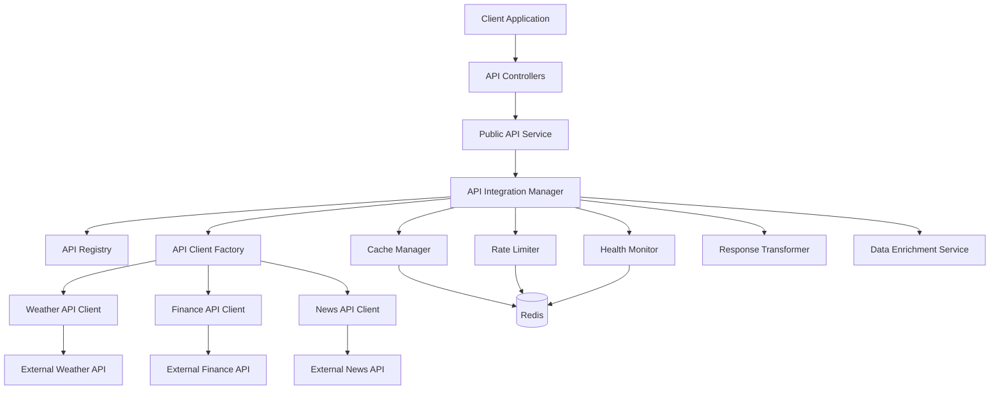
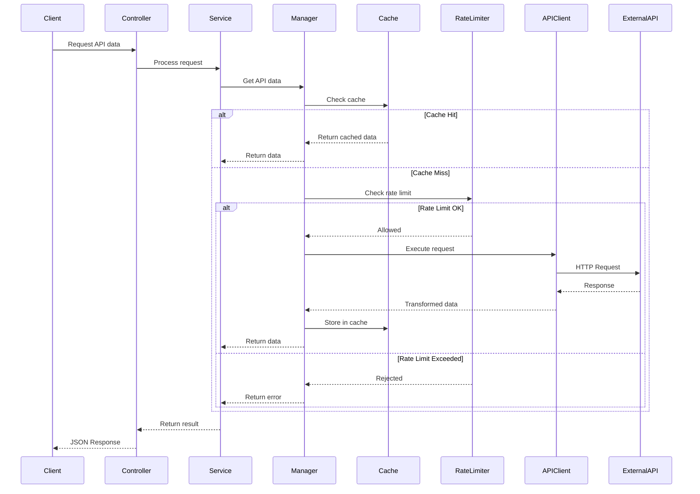

# Public API Integration - Design Document

## Overview

The Public API Integration system provides a comprehensive framework for integrating multiple external APIs from the Public APIs GitHub repository into the existing coding platform. This system extends the current architecture patterns established by Judge0 and OpenRouter integrations, providing a unified interface for managing weather, financial, news, and other public API services.

### Goals

- Provide a centralized API management system with configuration-driven integration
- Enable seamless integration of multiple public APIs with minimal code changes
- Implement robust error handling, retry logic, and circuit breaker patterns
- Optimize API usage through intelligent caching and rate limiting
- Support graceful degradation when external services are unavailable
- Enable data enrichment by combining multiple API sources
- Provide comprehensive monitoring and analytics for API usage

### Non-Goals

- Building custom implementations of API functionality (we integrate existing APIs)
- Real-time streaming data (focus is on request-response patterns)
- API versioning management (we use the latest stable versions)
- Custom API development or hosting

### Key Design Decisions

1. **Singleton Pattern for API Clients**: Following the OpenRouter pattern, each API client uses a singleton to prevent multiple instances and connection overhead
2. **Configuration-Driven Architecture**: API configurations stored in a registry allow adding new APIs without code changes
3. **Layered Caching Strategy**: Multi-level caching with different TTLs based on data volatility
4. **Circuit Breaker Pattern**: Automatic failover and health monitoring to prevent cascading failures
5. **Parallel Enrichment**: Data enrichment executes API calls in parallel to minimize latency
6. **Redis-Based State Management**: Leveraging existing Redis infrastructure for caching, rate limiting, and health tracking

## Architecture

### High-Level Architecture



### Component Interaction Flow



### Directory Structure

```
src/
├── lib/
│   ├── publicApi/
│   │   ├── apiRegistry.js          # API configuration registry
│   │   ├── apiClientFactory.js     # Factory for creating API clients
│   │   ├── baseApiClient.js        # Base class for all API clients
│   │   ├── cacheManager.js         # API-specific caching logic
│   │   ├── rateLimiter.js          # API rate limiting
│   │   ├── healthMonitor.js        # Health checking and circuit breaker
│   │   ├── responseTransformer.js  # Response standardization
│   │   ├── retryHandler.js         # Retry logic with exponential backoff
│   │   └── clients/
│   │       ├── weatherClient.js    # Weather API client
│   │       ├── financeClient.js    # Finance API client
│   │       └── newsClient.js       # News API client
│   ├── cache.js                    # Existing cache service
│   ├── redis.js                    # Existing Redis manager
│   ├── rateLimiter.js              # Existing rate limiter
│   └── logger.js                   # Existing logger
├── services/
│   ├── publicApiService.js         # Main service orchestrator
│   └── dataEnrichmentService.js    # Multi-API data enrichment
├── controllers/
│   └── publicApi.controller.js     # API endpoints controller
├── models/
│   ├── ApiUsageLog.js              # Usage tracking model
│   └── ApiConfiguration.js         # API config model (optional)
└── routes/
    └── publicApi.routes.js         # API routes
```

## Components and Interfaces

### 1. API Registry

The API Registry maintains configuration for all integrated APIs.

**File**: `src/lib/publicApi/apiRegistry.js`

**Interface**:
```javascript
class APIRegistry {
  constructor()
  
  // Load configurations from environment and files
  loadConfigurations(): void
  
  // Get configuration for a specific API
  getConfig(apiName: string): APIConfiguration | null
  
  // Register a new API configuration
  registerAPI(config: APIConfiguration): boolean
  
  // Update existing API configuration
  updateConfig(apiName: string, updates: Partial<APIConfiguration>): boolean
  
  // Get all APIs by category
  getAPIsByCategory(category: string): APIConfiguration[]
  
  // Get all registered APIs
  getAllAPIs(): APIConfiguration[]
  
  // Validate API configuration
  validateConfig(config: APIConfiguration): ValidationResult
  
  // Reload configurations without restart
  reloadConfigurations(): void
}
```

**Configuration Schema**:
```javascript
{
  name: string,              // Unique API identifier
  displayName: string,       // Human-readable name
  category: string,          // weather, finance, news, etc.
  baseURL: string,           // API base URL (must be HTTPS)
  auth: {
    type: string,            // 'header', 'query', 'bearer', 'basic'
    key: string,             // API key or token
    headerName: string,      // For header auth
    queryParam: string       // For query auth
  },
  timeout: number,           // Request timeout in ms (1-60000)
  rateLimit: {
    maxRequests: number,     // Max requests per window
    windowSeconds: number,   // Time window in seconds
    monthlyQuota: number     // Optional monthly limit
  },
  cache: {
    enabled: boolean,
    ttl: number              // Cache TTL in seconds
  },
  retry: {
    enabled: boolean,
    maxAttempts: number,     // Max retry attempts (default 3)
    backoffMs: number        // Initial backoff delay (default 1000)
  },
  health: {
    enabled: boolean,
    endpoint: string,        // Health check endpoint
    intervalSeconds: number  // Check interval (default 300)
  },
  fallbackAPI: string,       // Optional fallback API name
  metadata: {
    description: string,
    documentation: string,
    version: string
  }
}
```

### 2. Base API Client

Abstract base class that all specific API clients extend.

**File**: `src/lib/publicApi/baseApiClient.js`

**Interface**:
```javascript
class BaseAPIClient {
  constructor(config: APIConfiguration)
  
  // Initialize axios instance with config
  initialize(): void
  
  // Execute GET request
  get(endpoint: string, params?: object, options?: RequestOptions): Promise<APIResponse>
  
  // Execute POST request
  post(endpoint: string, data?: object, options?: RequestOptions): Promise<APIResponse>
  
  // Execute PUT request
  put(endpoint: string, data?: object, options?: RequestOptions): Promise<APIResponse>
  
  // Execute DELETE request
  delete(endpoint: string, options?: RequestOptions): Promise<APIResponse>
  
  // Execute request with full control
  request(config: AxiosRequestConfig): Promise<APIResponse>
  
  // Get client health status
  getHealth(): HealthStatus
  
  // Transform raw response to standard format
  transformResponse(data: any): any
}
```

**Response Format**:
```javascript
{
  success: boolean,
  data: any,
  metadata: {
    source: string,         // API name
    timestamp: string,      // ISO 8601 timestamp
    cached: boolean,        // Whether from cache
    responseTime: number    // Response time in ms
  },
  error?: {
    code: string,
    message: string,
    status: number
  }
}
```

### 3. API Client Factory

Factory for creating and managing API client instances.

**File**: `src/lib/publicApi/apiClientFactory.js`

**Interface**:
```javascript
class APIClientFactory {
  constructor(registry: APIRegistry)
  
  // Get or create API client instance (singleton)
  getClient(apiName: string): BaseAPIClient
  
  // Create new client instance
  createClient(apiName: string): BaseAPIClient
  
  // Check if client exists
  hasClient(apiName: string): boolean
  
  // Remove client instance
  removeClient(apiName: string): void
  
  // Get all active clients
  getAllClients(): Map<string, BaseAPIClient>
  
  // Reinitialize client with new config
  reinitializeClient(apiName: string): BaseAPIClient
}
```

### 4. Weather API Client

Specific implementation for weather APIs.

**File**: `src/lib/publicApi/clients/weatherClient.js`

**Interface**:
```javascript
class WeatherAPIClient extends BaseAPIClient {
  constructor(config: APIConfiguration)
  
  // Get current weather by coordinates
  getCurrentWeather(lat: number, lon: number): Promise<WeatherData>
  
  // Get current weather by city name
  getCurrentWeatherByCity(city: string): Promise<WeatherData>
  
  // Get weather forecast
  getForecast(lat: number, lon: number, days?: number): Promise<ForecastData>
  
  // Transform API-specific response to standard format
  transformResponse(data: any): WeatherData
}
```

**Weather Data Format**:
```javascript
{
  location: {
    name: string,
    country: string,
    coordinates: { lat: number, lon: number }
  },
  current: {
    temperature: { celsius: number, fahrenheit: number },
    feelsLike: { celsius: number, fahrenheit: number },
    condition: string,
    humidity: number,
    windSpeed: number,
    pressure: number,
    visibility: number
  },
  forecast?: Array<{
    date: string,
    temperature: { min: number, max: number },
    condition: string,
    precipitation: number
  }>
}
```

### 5. Finance API Client

Specific implementation for financial data APIs.

**File**: `src/lib/publicApi/clients/financeClient.js`

**Interface**:
```javascript
class FinanceAPIClient extends BaseAPIClient {
  constructor(config: APIConfiguration)
  
  // Get stock quote for single symbol
  getStockQuote(symbol: string): Promise<StockData>
  
  // Get quotes for multiple symbols
  getBatchQuotes(symbols: string[]): Promise<StockData[]>
  
  // Get market status
  getMarketStatus(): Promise<MarketStatus>
  
  // Transform API-specific response to standard format
  transformResponse(data: any): StockData
}
```

**Stock Data Format**:
```javascript
{
  symbol: string,
  name: string,
  price: {
    current: number,
    currency: string,
    formatted: string
  },
  change: {
    amount: number,
    percentage: number
  },
  market: {
    isOpen: boolean,
    lastClose: string
  },
  volume: number,
  timestamp: string
}
```

### 6. News API Client

Specific implementation for news APIs.

**File**: `src/lib/publicApi/clients/newsClient.js`

**Interface**:
```javascript
class NewsAPIClient extends BaseAPIClient {
  constructor(config: APIConfiguration)
  
  // Get top headlines
  getHeadlines(category?: string, country?: string): Promise<NewsData>
  
  // Search news by keyword
  searchNews(query: string, options?: SearchOptions): Promise<NewsData>
  
  // Get news by category
  getNewsByCategory(category: string): Promise<NewsData>
  
  // Transform API-specific response to standard format
  transformResponse(data: any): NewsData
}
```

**News Data Format**:
```javascript
{
  articles: Array<{
    title: string,
    description: string,
    content: string,
    url: string,
    imageUrl: string,
    source: {
      name: string,
      url: string
    },
    author: string,
    publishedAt: string,  // ISO 8601
    category: string
  }>,
  totalResults: number,
  page: number,
  pageSize: number
}
```

### 7. Cache Manager

Manages caching for API responses with configurable TTL.

**File**: `src/lib/publicApi/cacheManager.js`

**Interface**:
```javascript
class APICacheManager {
  constructor(redisManager: RedisManager)
  
  // Generate cache key from API name, endpoint, and params
  generateKey(apiName: string, endpoint: string, params?: object): string
  
  // Get cached response
  get(key: string): Promise<any>
  
  // Set cached response with TTL
  set(key: string, data: any, ttl: number): Promise<boolean>
  
  // Invalidate cache by API name
  invalidateByAPI(apiName: string): Promise<boolean>
  
  // Invalidate specific cache key
  invalidate(key: string): Promise<boolean>
  
  // Get cache statistics
  getStats(apiName: string): Promise<CacheStats>
}
```

### 8. Rate Limiter

Manages rate limiting for API requests.

**File**: `src/lib/publicApi/rateLimiter.js`

**Interface**:
```javascript
class APIRateLimiter {
  constructor(redisManager: RedisManager)
  
  // Check if request is allowed
  checkLimit(apiName: string): Promise<RateLimitResult>
  
  // Increment request counter
  incrementCounter(apiName: string): Promise<number>
  
  // Get remaining quota
  getRemainingQuota(apiName: string): Promise<number>
  
  // Reset rate limit for API
  resetLimit(apiName: string): Promise<boolean>
  
  // Check monthly quota
  checkMonthlyQuota(apiName: string): Promise<QuotaStatus>
  
  // Get rate limit info
  getLimitInfo(apiName: string): Promise<RateLimitInfo>
}
```

**Rate Limit Result**:
```javascript
{
  allowed: boolean,
  current: number,
  limit: number,
  remaining: number,
  resetAt: number,        // Unix timestamp
  retryAfter: number      // Seconds until reset
}
```

### 9. Health Monitor

Monitors API health and implements circuit breaker pattern.

**File**: `src/lib/publicApi/healthMonitor.js`

**Interface**:
```javascript
class HealthMonitor {
  constructor(registry: APIRegistry, clientFactory: APIClientFactory)
  
  // Start health monitoring
  start(): void
  
  // Stop health monitoring
  stop(): void
  
  // Perform health check for specific API
  checkHealth(apiName: string): Promise<HealthStatus>
  
  // Get health status for all APIs
  getAllHealthStatus(): Promise<Map<string, HealthStatus>>
  
  // Get health statistics
  getHealthStats(apiName: string): Promise<HealthStats>
  
  // Manually mark API as healthy/unhealthy
  setHealthStatus(apiName: string, status: string): void
  
  // Check if circuit breaker is open
  isCircuitOpen(apiName: string): boolean
  
  // Reset circuit breaker
  resetCircuit(apiName: string): void
}
```

**Health Status**:
```javascript
{
  apiName: string,
  status: 'healthy' | 'unhealthy' | 'degraded',
  lastCheck: string,
  responseTime: number,
  consecutiveFailures: number,
  circuitState: 'closed' | 'open' | 'half-open',
  uptime: number,         // Percentage over 24h
  errorRate: number       // Percentage over 24h
}
```

### 10. Response Transformer

Transforms external API responses to standardized format.

**File**: `src/lib/publicApi/responseTransformer.js`

**Interface**:
```javascript
class ResponseTransformer {
  constructor()
  
  // Register custom transformer for API
  registerTransformer(apiName: string, transformer: Function): void
  
  // Transform response using registered transformer
  transform(apiName: string, data: any): any
  
  // Validate response has required fields
  validate(data: any, requiredFields: string[]): ValidationResult
  
  // Extract and map fields
  mapFields(data: any, fieldMapping: object): any
  
  // Parse different response formats
  parseResponse(data: any, format: 'json' | 'xml' | 'text'): any
}
```

### 11. Retry Handler

Implements retry logic with exponential backoff.

**File**: `src/lib/publicApi/retryHandler.js`

**Interface**:
```javascript
class RetryHandler {
  constructor()
  
  // Execute function with retry logic
  executeWithRetry(fn: Function, options: RetryOptions): Promise<any>
  
  // Check if error is retryable
  isRetryable(error: Error): boolean
  
  // Calculate backoff delay
  calculateBackoff(attempt: number, baseDelay: number): number
  
  // Get retry configuration for API
  getRetryConfig(apiName: string): RetryConfig
}
```

**Retry Options**:
```javascript
{
  maxAttempts: number,      // Default 3
  baseDelay: number,        // Default 1000ms
  maxDelay: number,         // Default 30000ms
  retryableStatuses: number[], // [429, 500, 502, 503, 504]
  onRetry: Function         // Callback on retry
}
```

### 12. Data Enrichment Service

Combines data from multiple APIs.

**File**: `src/services/dataEnrichmentService.js`

**Interface**:
```javascript
class DataEnrichmentService {
  constructor(apiManager: APIIntegrationManager)
  
  // Execute enrichment pipeline
  enrich(pipeline: EnrichmentPipeline): Promise<EnrichedData>
  
  // Combine weather and location data
  enrichLocationData(location: object): Promise<object>
  
  // Combine financial data from multiple sources
  enrichFinancialData(symbol: string): Promise<object>
  
  // Handle partial failures in enrichment
  handlePartialFailure(results: any[]): EnrichedData
}
```

### 13. Public API Service

Main service orchestrator.

**File**: `src/services/publicApiService.js`

**Interface**:
```javascript
class PublicAPIService {
  constructor()
  
  // Get weather data
  getWeather(location: object): Promise<APIResponse>
  
  // Get stock data
  getStockData(symbols: string[]): Promise<APIResponse>
  
  // Get news
  getNews(options: object): Promise<APIResponse>
  
  // Execute generic API request
  executeRequest(apiName: string, endpoint: string, params: object): Promise<APIResponse>
  
  // Get API health status
  getHealthStatus(apiName?: string): Promise<HealthStatus>
  
  // Get usage analytics
  getUsageAnalytics(apiName: string, timeRange: object): Promise<UsageStats>
  
  // Validate API configuration
  validateConfiguration(config: APIConfiguration): Promise<ValidationResult>
}
```

### 14. Public API Controller

Handles HTTP requests for public API endpoints.

**File**: `src/controllers/publicApi.controller.js`

**Endpoints**:
- `GET /api/public-apis/weather/current` - Get current weather
- `GET /api/public-apis/weather/forecast` - Get weather forecast
- `GET /api/public-apis/finance/quote/:symbol` - Get stock quote
- `GET /api/public-apis/finance/quotes` - Get multiple stock quotes
- `GET /api/public-apis/news/headlines` - Get news headlines
- `GET /api/public-apis/news/search` - Search news
- `GET /api/public-apis/registry` - List all available APIs
- `GET /api/public-apis/health` - Get health status
- `GET /api/public-apis/analytics/:apiName` - Get usage analytics
- `POST /api/public-apis/config/validate` - Validate API configuration

## Data Models

### API Usage Log Model

**File**: `src/models/ApiUsageLog.js`

```javascript
{
  apiName: { type: String, required: true, index: true },
  endpoint: { type: String, required: true },
  method: { type: String, required: true },
  userId: { type: mongoose.Schema.Types.ObjectId, ref: 'User', index: true },
  requestParams: { type: Object },
  responseStatus: { type: Number, required: true },
  responseTime: { type: Number, required: true },
  cached: { type: Boolean, default: false },
  error: { type: String },
  timestamp: { type: Date, default: Date.now, index: true },
  metadata: {
    userAgent: String,
    ip: String,
    rateLimitRemaining: Number
  }
}
```

**Indexes**:
- `{ apiName: 1, timestamp: -1 }`
- `{ userId: 1, timestamp: -1 }`
- `{ timestamp: -1 }` with TTL of 30 days


### API Configuration Model (Optional)

**File**: `src/models/ApiConfiguration.js`

```javascript
{
  name: { type: String, required: true, unique: true },
  displayName: { type: String, required: true },
  category: { type: String, required: true, enum: ['weather', 'finance', 'news', 'sports', 'entertainment', 'utility'] },
  baseURL: { type: String, required: true },
  auth: {
    type: { type: String, required: true, enum: ['header', 'query', 'bearer', 'basic'] },
    key: { type: String, required: true },
    headerName: String,
    queryParam: String
  },
  timeout: { type: Number, default: 10000, min: 1000, max: 60000 },
  rateLimit: {
    maxRequests: { type: Number, required: true },
    windowSeconds: { type: Number, required: true },
    monthlyQuota: Number
  },
  cache: {
    enabled: { type: Boolean, default: true },
    ttl: { type: Number, default: 300 }
  },
  retry: {
    enabled: { type: Boolean, default: true },
    maxAttempts: { type: Number, default: 3 },
    backoffMs: { type: Number, default: 1000 }
  },
  health: {
    enabled: { type: Boolean, default: true },
    endpoint: String,
    intervalSeconds: { type: Number, default: 300 }
  },
  fallbackAPI: String,
  metadata: {
    description: String,
    documentation: String,
    version: String
  },
  isActive: { type: Boolean, default: true },
  createdAt: { type: Date, default: Date.now },
  updatedAt: { type: Date, default: Date.now }
}
```

## API Endpoint Specifications

### Weather Endpoints

#### Get Current Weather
```
GET /api/public-apis/weather/current
Query Parameters:
  - lat: number (latitude)
  - lon: number (longitude)
  OR
  - city: string (city name)
  - country: string (optional, country code)

Response: 200 OK
{
  "success": true,
  "data": {
    "location": {
      "name": "San Francisco",
      "country": "US",
      "coordinates": { "lat": 37.7749, "lon": -122.4194 }
    },
    "current": {
      "temperature": { "celsius": 18, "fahrenheit": 64 },
      "feelsLike": { "celsius": 16, "fahrenheit": 61 },
      "condition": "Partly Cloudy",
      "humidity": 65,
      "windSpeed": 12,
      "pressure": 1013,
      "visibility": 10
    }
  },
  "metadata": {
    "source": "openweathermap",
    "timestamp": "2024-01-15T10:30:00Z",
    "cached": false,
    "responseTime": 245
  }
}
```

#### Get Weather Forecast
```
GET /api/public-apis/weather/forecast
Query Parameters:
  - lat: number (latitude)
  - lon: number (longitude)
  - days: number (optional, default 5, max 7)

Response: 200 OK
{
  "success": true,
  "data": {
    "location": { ... },
    "current": { ... },
    "forecast": [
      {
        "date": "2024-01-16",
        "temperature": { "min": 12, "max": 20 },
        "condition": "Sunny",
        "precipitation": 0
      }
    ]
  },
  "metadata": { ... }
}
```

### Finance Endpoints

#### Get Stock Quote
```
GET /api/public-apis/finance/quote/:symbol
Path Parameters:
  - symbol: string (stock ticker symbol)

Response: 200 OK
{
  "success": true,
  "data": {
    "symbol": "AAPL",
    "name": "Apple Inc.",
    "price": {
      "current": 185.50,
      "currency": "USD",
      "formatted": "$185.50"
    },
    "change": {
      "amount": 2.30,
      "percentage": 1.25
    },
    "market": {
      "isOpen": true,
      "lastClose": "2024-01-14T21:00:00Z"
    },
    "volume": 52000000,
    "timestamp": "2024-01-15T14:30:00Z"
  },
  "metadata": { ... }
}
```

#### Get Multiple Stock Quotes
```
GET /api/public-apis/finance/quotes
Query Parameters:
  - symbols: string (comma-separated ticker symbols, max 10)

Response: 200 OK
{
  "success": true,
  "data": [
    { "symbol": "AAPL", ... },
    { "symbol": "GOOGL", ... }
  ],
  "metadata": { ... }
}
```

### News Endpoints

#### Get News Headlines
```
GET /api/public-apis/news/headlines
Query Parameters:
  - category: string (optional: technology, business, sports, entertainment)
  - country: string (optional: country code)
  - page: number (optional, default 1)
  - pageSize: number (optional, default 20, max 20)

Response: 200 OK
{
  "success": true,
  "data": {
    "articles": [
      {
        "title": "Breaking News Title",
        "description": "Article description...",
        "content": "Full article content...",
        "url": "https://example.com/article",
        "imageUrl": "https://example.com/image.jpg",
        "source": {
          "name": "Tech News",
          "url": "https://technews.com"
        },
        "author": "John Doe",
        "publishedAt": "2024-01-15T10:00:00Z",
        "category": "technology"
      }
    ],
    "totalResults": 150,
    "page": 1,
    "pageSize": 20
  },
  "metadata": { ... }
}
```

#### Search News
```
GET /api/public-apis/news/search
Query Parameters:
  - q: string (required, search query)
  - from: string (optional, ISO date)
  - to: string (optional, ISO date)
  - sortBy: string (optional: relevancy, popularity, publishedAt)
  - page: number (optional, default 1)
  - pageSize: number (optional, default 20, max 20)

Response: 200 OK
{
  "success": true,
  "data": { ... },
  "metadata": { ... }
}
```

### Registry and Management Endpoints

#### List Available APIs
```
GET /api/public-apis/registry
Query Parameters:
  - category: string (optional, filter by category)

Response: 200 OK
{
  "success": true,
  "data": {
    "apis": [
      {
        "name": "openweathermap",
        "displayName": "OpenWeatherMap",
        "category": "weather",
        "description": "Weather data and forecasts",
        "status": "healthy",
        "rateLimit": {
          "maxRequests": 60,
          "windowSeconds": 60,
          "remaining": 45
        },
        "documentation": "https://openweathermap.org/api"
      }
    ],
    "total": 5
  }
}
```

#### Get Health Status
```
GET /api/public-apis/health
Query Parameters:
  - apiName: string (optional, specific API)

Response: 200 OK
{
  "success": true,
  "data": {
    "openweathermap": {
      "status": "healthy",
      "lastCheck": "2024-01-15T10:25:00Z",
      "responseTime": 150,
      "consecutiveFailures": 0,
      "circuitState": "closed",
      "uptime": 99.8,
      "errorRate": 0.2
    }
  }
}
```

#### Get Usage Analytics
```
GET /api/public-apis/analytics/:apiName
Query Parameters:
  - from: string (ISO date, default: 30 days ago)
  - to: string (ISO date, default: now)
  - groupBy: string (optional: hour, day, week)

Response: 200 OK
{
  "success": true,
  "data": {
    "apiName": "openweathermap",
    "period": {
      "from": "2024-01-01T00:00:00Z",
      "to": "2024-01-15T23:59:59Z"
    },
    "summary": {
      "totalRequests": 15000,
      "successfulRequests": 14850,
      "failedRequests": 150,
      "successRate": 99.0,
      "averageResponseTime": 180,
      "cacheHitRate": 65.5,
      "estimatedCost": 0.00
    },
    "daily": [
      {
        "date": "2024-01-15",
        "requests": 1200,
        "successRate": 99.2,
        "avgResponseTime": 175
      }
    ]
  }
}
```

#### Validate Configuration
```
POST /api/public-apis/config/validate
Body:
{
  "name": "newapi",
  "baseURL": "https://api.example.com",
  "auth": { ... },
  "timeout": 10000,
  "rateLimit": { ... }
}

Response: 200 OK
{
  "success": true,
  "data": {
    "valid": true,
    "checks": {
      "urlReachable": true,
      "authenticationValid": true,
      "configurationComplete": true
    }
  }
}

Response: 400 Bad Request
{
  "success": false,
  "error": {
    "code": "VALIDATION_FAILED",
    "message": "Configuration validation failed",
    "details": [
      "baseURL must use HTTPS protocol",
      "timeout must be between 1000 and 60000"
    ]
  }
}
```

## Error Handling

### Error Response Format

All errors follow a consistent format:

```javascript
{
  "success": false,
  "error": {
    "code": string,           // Error code
    "message": string,        // Human-readable message
    "status": number,         // HTTP status code
    "details": any,           // Additional error details
    "timestamp": string,      // ISO 8601 timestamp
    "requestId": string       // Unique request identifier
  }
}
```

### Error Codes

| Code | Description | HTTP Status |
|------|-------------|-------------|
| `API_NOT_FOUND` | Requested API not registered | 404 |
| `API_UNAVAILABLE` | API is currently unavailable | 503 |
| `RATE_LIMIT_EXCEEDED` | Rate limit exceeded | 429 |
| `AUTHENTICATION_FAILED` | API authentication failed | 401 |
| `INVALID_PARAMETERS` | Invalid request parameters | 400 |
| `TIMEOUT` | Request timeout | 504 |
| `CIRCUIT_OPEN` | Circuit breaker is open | 503 |
| `VALIDATION_FAILED` | Configuration validation failed | 400 |
| `CACHE_ERROR` | Cache operation failed | 500 |
| `TRANSFORMATION_ERROR` | Response transformation failed | 500 |
| `EXTERNAL_API_ERROR` | External API returned error | 502 |

### Retry Strategy

**Retryable Errors**:
- HTTP 429 (Too Many Requests)
- HTTP 500 (Internal Server Error)
- HTTP 502 (Bad Gateway)
- HTTP 503 (Service Unavailable)
- HTTP 504 (Gateway Timeout)
- Network timeouts
- Connection errors

**Non-Retryable Errors**:
- HTTP 400 (Bad Request)
- HTTP 401 (Unauthorized)
- HTTP 403 (Forbidden)
- HTTP 404 (Not Found)
- Validation errors

**Retry Configuration**:
```javascript
{
  maxAttempts: 3,
  delays: [1000, 2000, 4000],  // Exponential backoff
  retryableStatuses: [429, 500, 502, 503, 504]
}
```

### Circuit Breaker Pattern

**States**:
- **Closed**: Normal operation, requests pass through
- **Open**: Too many failures, requests fail immediately
- **Half-Open**: Testing if service recovered

**Thresholds**:
- Failure threshold: 50% error rate over 10 requests
- Success threshold to close: 3 consecutive successful requests
- Open duration: 60 seconds before attempting half-open

**Implementation**:
```javascript
// Circuit opens after 5 consecutive failures
if (consecutiveFailures >= 5) {
  circuitState = 'open';
  openedAt = Date.now();
}

// After 60 seconds, try half-open
if (circuitState === 'open' && Date.now() - openedAt > 60000) {
  circuitState = 'half-open';
}

// Close circuit after 3 successful requests in half-open
if (circuitState === 'half-open' && consecutiveSuccesses >= 3) {
  circuitState = 'closed';
  consecutiveFailures = 0;
}
```

### Graceful Degradation

**Fallback Hierarchy**:
1. Return cached data if available (even if expired)
2. Use fallback API if configured
3. Return partial data with error indication
4. Return user-friendly error message

**Example**:
```javascript
async function getWeatherWithFallback(location) {
  try {
    // Try primary API
    return await primaryWeatherAPI.getCurrentWeather(location);
  } catch (error) {
    logger.warn('Primary weather API failed, trying cache');
    
    // Try cache (even expired)
    const cached = await cache.get(cacheKey, { allowExpired: true });
    if (cached) {
      return { ...cached, metadata: { ...cached.metadata, stale: true } };
    }
    
    // Try fallback API
    if (config.fallbackAPI) {
      logger.warn('Trying fallback weather API');
      return await fallbackWeatherAPI.getCurrentWeather(location);
    }
    
    // Return error
    throw new APIError('Weather service temporarily unavailable', 503);
  }
}
```

## Caching Strategies

### Cache Key Generation

```javascript
function generateCacheKey(apiName, endpoint, params) {
  const sortedParams = Object.keys(params)
    .sort()
    .reduce((acc, key) => {
      acc[key] = params[key];
      return acc;
    }, {});
  
  const paramString = JSON.stringify(sortedParams);
  const hash = crypto.createHash('md5').update(paramString).digest('hex');
  
  return `api:${apiName}:${endpoint}:${hash}`;
}
```

### TTL Configuration by Data Type

| Data Type | TTL | Rationale |
|-----------|-----|-----------|
| Stock prices (market open) | 60s | Real-time data, frequent updates |
| Stock prices (market closed) | 3600s | Static until market opens |
| Weather current | 600s | Updates every 10 minutes |
| Weather forecast | 1800s | Updates every 30 minutes |
| News headlines | 900s | Updates every 15 minutes |
| News search results | 1800s | Less time-sensitive |
| API health status | 300s | Regular monitoring |
| API registry | 3600s | Rarely changes |

### Cache Invalidation

**Strategies**:
1. **TTL-based**: Automatic expiration after configured time
2. **Event-based**: Invalidate on configuration changes
3. **Manual**: Admin-triggered invalidation
4. **Pattern-based**: Invalidate all keys matching pattern

**Implementation**:
```javascript
// Invalidate all weather API caches
await cacheManager.invalidateByAPI('openweathermap');

// Invalidate specific endpoint
await cacheManager.invalidate('api:openweathermap:current:abc123');

// Invalidate by pattern
await cacheManager.invalidateByPattern('api:*:news:*');
```

### Cache Warming

Pre-populate cache for frequently accessed data:

```javascript
async function warmCache() {
  const popularLocations = ['New York', 'London', 'Tokyo'];
  const popularStocks = ['AAPL', 'GOOGL', 'MSFT'];
  
  // Warm weather cache
  for (const city of popularLocations) {
    await weatherClient.getCurrentWeatherByCity(city);
  }
  
  // Warm stock cache
  await financeClient.getBatchQuotes(popularStocks);
  
  logger.info('Cache warming completed');
}
```

## Testing Strategy

### Unit Testing

Test individual components in isolation using mocks.

**Test Coverage Requirements**:
- All public methods in API clients
- Cache manager operations
- Rate limiter logic
- Health monitor state transitions
- Response transformation
- Retry handler logic
- Error handling paths

**Example Unit Tests**:
```javascript
describe('WeatherAPIClient', () => {
  it('should transform API response to standard format', () => {
    const rawResponse = { temp: 20, humidity: 65 };
    const transformed = client.transformResponse(rawResponse);
    expect(transformed.current.temperature.celsius).toBe(20);
  });
  
  it('should handle API timeout errors', async () => {
    mockAxios.get.mockRejectedValue(new Error('ETIMEDOUT'));
    await expect(client.getCurrentWeather(0, 0)).rejects.toThrow();
  });
});

describe('RetryHandler', () => {
  it('should retry on 429 status code', async () => {
    const fn = jest.fn()
      .mockRejectedValueOnce({ response: { status: 429 } })
      .mockResolvedValueOnce({ data: 'success' });
    
    const result = await retryHandler.executeWithRetry(fn);
    expect(fn).toHaveBeenCalledTimes(2);
    expect(result.data).toBe('success');
  });
  
  it('should not retry on 401 status code', async () => {
    const fn = jest.fn()
      .mockRejectedValue({ response: { status: 401 } });
    
    await expect(retryHandler.executeWithRetry(fn)).rejects.toThrow();
    expect(fn).toHaveBeenCalledTimes(1);
  });
});

describe('APICacheManager', () => {
  it('should generate consistent cache keys', () => {
    const key1 = cacheManager.generateKey('api', '/endpoint', { b: 2, a: 1 });
    const key2 = cacheManager.generateKey('api', '/endpoint', { a: 1, b: 2 });
    expect(key1).toBe(key2);
  });
});
```

### Integration Testing

Test component interactions with real Redis and mocked external APIs.

**Test Scenarios**:
- End-to-end API request flow
- Cache hit/miss scenarios
- Rate limiting enforcement
- Circuit breaker state transitions
- Fallback API usage
- Data enrichment pipelines

**Example Integration Tests**:
```javascript
describe('Public API Integration', () => {
  beforeAll(async () => {
    await redisManager.connect();
  });
  
  it('should cache API responses', async () => {
    mockExternalAPI.get.mockResolvedValue({ data: { temp: 20 } });
    
    const result1 = await publicAPIService.getWeather({ city: 'London' });
    const result2 = await publicAPIService.getWeather({ city: 'London' });
    
    expect(mockExternalAPI.get).toHaveBeenCalledTimes(1);
    expect(result2.metadata.cached).toBe(true);
  });
  
  it('should enforce rate limits', async () => {
    const requests = Array(11).fill().map(() => 
      publicAPIService.getWeather({ city: 'London' })
    );
    
    const results = await Promise.allSettled(requests);
    const rejected = results.filter(r => r.status === 'rejected');
    
    expect(rejected.length).toBeGreaterThan(0);
    expect(rejected[0].reason.code).toBe('RATE_LIMIT_EXCEEDED');
  });
  
  it('should use fallback API when primary fails', async () => {
    mockPrimaryAPI.get.mockRejectedValue(new Error('Service unavailable'));
    mockFallbackAPI.get.mockResolvedValue({ data: { temp: 20 } });
    
    const result = await publicAPIService.getWeather({ city: 'London' });
    
    expect(result.success).toBe(true);
    expect(result.metadata.source).toBe('fallback-weather-api');
  });
});
```

### Property-Based Testing

Will be defined in the Correctness Properties section below.

### End-to-End Testing

Test complete user workflows with real external APIs (in staging environment).

**Test Scenarios**:
- Fetch weather data for various locations
- Get stock quotes during market hours
- Search and retrieve news articles
- Handle API failures gracefully
- Monitor health status changes
- Track usage analytics

## Integration with Existing Infrastructure

### Redis Integration

**Usage**:
- Cache storage for API responses
- Rate limit counters
- Health status tracking
- Circuit breaker state
- Usage analytics

**Key Patterns**:
```
api:{apiName}:{endpoint}:{hash}           # Cached responses
ratelimit:api:{apiName}:{window}          # Rate limit counters
health:{apiName}:status                   # Health status
health:{apiName}:failures                 # Failure counter
circuit:{apiName}:state                   # Circuit breaker state
analytics:{apiName}:{date}:requests       # Request counter
analytics:{apiName}:{date}:errors         # Error counter
```

### Logging Integration

Use existing Winston logger with structured logging:

```javascript
logger.info('API request executed', {
  apiName: 'openweathermap',
  endpoint: '/weather',
  responseTime: 245,
  cached: false,
  userId: 'user123'
});

logger.error('API request failed', {
  apiName: 'openweathermap',
  endpoint: '/weather',
  error: error.message,
  statusCode: 500,
  retryAttempt: 2
});
```

### Rate Limiter Integration

Extend existing rate limiter with API-specific limits:

```javascript
// Existing rate limiter for user requests
rateLimiter.middleware('api');

// New API-specific rate limiter
apiRateLimiter.middleware('openweathermap');
```

### RabbitMQ Integration (Optional)

For async API requests and background processing:

**Queues**:
- `api_requests`: Async API request processing
- `api_health_checks`: Scheduled health checks
- `api_cache_warming`: Cache warming tasks
- `api_analytics`: Analytics aggregation

**Usage**:
```javascript
// Queue async API request
await rabbitMQ.publish('api_requests', {
  apiName: 'openweathermap',
  endpoint: '/weather',
  params: { city: 'London' },
  userId: 'user123'
});

// Process health checks
await rabbitMQ.consume('api_health_checks', async (message) => {
  await healthMonitor.checkHealth(message.apiName);
});
```

### Middleware Integration

**Authentication Middleware**: Reuse existing auth middleware
**Rate Limiting Middleware**: Apply both user and API rate limits
**Logging Middleware**: Use existing request logging
**Error Handling Middleware**: Extend with API-specific errors

```javascript
router.get('/weather/current',
  authenticate,
  rateLimiter.middleware('api'),
  apiRateLimiter.middleware('openweathermap'),
  weatherController.getCurrentWeather
);
```


## Correctness Properties

A property is a characteristic or behavior that should hold true across all valid executions of a system—essentially, a formal statement about what the system should do. Properties serve as the bridge between human-readable specifications and machine-verifiable correctness guarantees.

### Property Reflection

After analyzing all acceptance criteria, I identified several areas of redundancy:

**Redundancies Eliminated**:
1. Multiple properties about "response completeness" (8.2, 9.2, 10.2) can be combined into a single property about API response transformation
2. Multiple properties about "specific TTL configuration" (4.4, 4.5, 8.5, 9.4, 10.5) are examples, not properties - they test specific configurations
3. Multiple properties about "field presence" (7.4, 7.5) can be combined into one comprehensive validation property
4. Properties about "logging" (3.7, 12.1) can be combined into one property about request logging
5. Properties about "quota warnings" (5.7, 12.5) are the same threshold check, can be combined

**Properties Retained**:
- Each unique behavioral property that validates a distinct aspect of system correctness
- Properties that test different patterns (round-trip, invariants, error conditions)
- Properties that validate different components independently

### Property 1: Configuration Round-Trip

*For any* valid API configuration, storing it in the registry and then retrieving it should return an equivalent configuration with all fields preserved.

**Validates: Requirements 1.1**

### Property 2: Configuration Validation Rejects Invalid Input

*For any* API configuration with missing required fields or invalid values, the registry validation should reject it and return specific error messages indicating which fields are invalid.

**Validates: Requirements 1.2, 14.1, 14.6**

### Property 3: Authentication Method Support

*For any* supported authentication type (header, query, bearer, basic), storing a configuration with that auth type and retrieving it should preserve the auth configuration correctly.

**Validates: Requirements 1.3**

### Property 4: Configuration Hot Reload

*For any* registered API configuration, updating it and then retrieving it should return the updated values without requiring application restart.

**Validates: Requirements 1.5**

### Property 5: Category-Based Retrieval

*For any* API with a category, querying the registry by that category should include that API in the results.

**Validates: Requirements 1.6**

### Property 6: HTTPS Protocol Enforcement

*For any* API configuration with a base URL using HTTP (not HTTPS), the registry validation should reject it.

**Validates: Requirements 1.7**

### Property 7: Client Factory Singleton Pattern

*For any* registered API name, calling the factory's getClient method multiple times should return the same client instance (referential equality).

**Validates: Requirements 2.3**

### Property 8: Client Configuration Injection

*For any* API client created by the factory, the client's configuration should match the configuration stored in the registry for that API name.

**Validates: Requirements 2.2, 2.4**

### Property 9: Retry on Retryable Status Codes

*For any* API request that fails with a retryable status code (429, 500, 502, 503, 504), the retry handler should attempt the request again with exponential backoff.

**Validates: Requirements 3.1**

### Property 10: No Retry on Authentication Errors

*For any* API request that fails with status code 401 or 403, the retry handler should not retry the request and should return an error immediately.

**Validates: Requirements 3.5**

### Property 11: Error Response Standardization

*For any* failed API request after all retries, the response should include a standardized error object with code, message, status, and timestamp fields.

**Validates: Requirements 3.4**

### Property 12: Request Timeout Enforcement

*For any* API client with a configured timeout, requests that exceed the timeout duration should fail with a timeout error.

**Validates: Requirements 3.6**

### Property 13: Cache Key Consistency

*For any* API name, endpoint, and parameters, generating a cache key multiple times with the same inputs (regardless of parameter order) should produce the same key.

**Validates: Requirements 4.3**

### Property 14: Cache Hit Avoids External Call

*For any* API request where a valid cached response exists, the client should return the cached data without making an external API call.

**Validates: Requirements 4.2**

### Property 15: Successful Response Caching

*For any* successful API response, the cache manager should store it in Redis with the configured TTL.

**Validates: Requirements 4.1**

### Property 16: Cache Invalidation

*For any* cached response, invalidating its cache key should remove it from the cache, and subsequent requests should not return cached data.

**Validates: Requirements 4.6**

### Property 17: Rate Limit Enforcement

*For any* API with a configured rate limit, making requests that exceed the limit within the time window should result in rejection with a 429 status code.

**Validates: Requirements 5.2**

### Property 18: Rate Limit Counter Accuracy

*For any* API, the rate limiter should accurately track the number of requests made within each time window.

**Validates: Requirements 5.1**

### Property 19: Rate Limit Window Support

*For any* supported time window type (second, minute, hour, day), the rate limiter should correctly enforce limits for that window.

**Validates: Requirements 5.3**

### Property 20: Rate Limit Configuration Consistency

*For any* API, the rate limiter's enforced limits should match the limits configured in the API registry.

**Validates: Requirements 5.4**

### Property 21: Retry-After Header Inclusion

*For any* request rejected due to rate limiting, the response should include a Retry-After header indicating when requests can resume.

**Validates: Requirements 5.5**

### Property 22: Quota Check Non-Mutation

*For any* API, checking the remaining quota should not increment the request counter.

**Validates: Requirements 5.6**

### Property 23: Health Check Success Updates Status

*For any* API, when a health check succeeds, the health monitor should update the API status to healthy and record the response time.

**Validates: Requirements 6.2**

### Property 24: Health Status Transition Events

*For any* API that transitions from healthy to unhealthy (or vice versa), the health monitor should emit a notification event.

**Validates: Requirements 6.5**

### Property 25: Health Metrics Tracking

*For any* API, the health monitor should track average response time, success rate, and uptime percentage over the configured time window.

**Validates: Requirements 6.6**

### Property 26: Circuit Breaker Activation

*For any* API with a failure rate exceeding 50%, the circuit breaker should open and temporarily disable the API.

**Validates: Requirements 6.7**

### Property 27: Response Transformation to Standard Format

*For any* external API response, the response transformer should convert it to a standardized format with success, data, and metadata fields.

**Validates: Requirements 7.1, 8.2, 9.2, 10.2**

### Property 28: Field Mapping Consistency

*For any* API response, the transformer should map external field names to internal field names according to the registered field mapping.

**Validates: Requirements 7.2**

### Property 29: Response Format Support

*For any* supported response format (JSON, XML, text), the transformer should correctly parse and transform the response.

**Validates: Requirements 7.3**

### Property 30: Required Field Validation

*For any* API response missing required fields, the transformer should return an error indicating which fields are missing.

**Validates: Requirements 7.4, 7.5**

### Property 31: Custom Transformer Registration

*For any* API with a registered custom transformer function, the response transformer should use that function instead of the default transformation.

**Validates: Requirements 7.6**

### Property 32: Metadata Preservation

*For any* transformed API response, the metadata should include the source API name, timestamp, cached status, and response time.

**Validates: Requirements 7.7**

### Property 33: Temperature Unit Conversion

*For any* weather API response, the transformer should provide temperature values in both Celsius and Fahrenheit.

**Validates: Requirements 8.4**

### Property 34: Location Query Support

*For any* weather API client, querying by city name should return weather data for that location.

**Validates: Requirements 8.7**

### Property 35: Batch Stock Quote Support

*For any* list of ticker symbols, the finance API client should return stock data for all symbols in a single request.

**Validates: Requirements 9.3**

### Property 36: Currency Standardization

*For any* financial API response, currency values should include both a currency code and a formatted string representation.

**Validates: Requirements 9.5**

### Property 37: News Category Filtering

*For any* news category, requesting news for that category should return only articles from that category.

**Validates: Requirements 10.3**

### Property 38: News Keyword Search

*For any* search keyword, the news API client should return articles containing that keyword.

**Validates: Requirements 10.4**

### Property 39: Date Format Standardization

*For any* news API response, published dates should be formatted in ISO 8601 format.

**Validates: Requirements 10.6**

### Property 40: Multi-Source Data Aggregation

*For any* enrichment pipeline with multiple APIs, the enriched response should contain data from all successful API calls with source attribution.

**Validates: Requirements 11.1, 11.7**

### Property 41: Partial Failure Handling

*For any* enrichment pipeline where some APIs fail, the service should return available data from successful APIs and indicate which APIs failed.

**Validates: Requirements 11.3**

### Property 42: Pipeline Configuration Execution

*For any* configured enrichment pipeline, the service should execute all APIs defined in the pipeline configuration.

**Validates: Requirements 11.4**

### Property 43: Failure Isolation in Pipelines

*For any* enrichment pipeline, if one API fails, the service should continue processing the remaining APIs.

**Validates: Requirements 11.5**

### Property 44: Request Logging Completeness

*For any* API request, the system should log an entry containing API name, endpoint, response time, status code, and timestamp.

**Validates: Requirements 3.7, 12.1**

### Property 45: Usage Statistics Aggregation

*For any* API and time period, the system should calculate total requests, success rate, and average response time accurately.

**Validates: Requirements 12.2**

### Property 46: Cost Calculation Accuracy

*For any* API with pricing information, the system should calculate estimated costs based on actual usage volumes.

**Validates: Requirements 12.3**

### Property 47: Quota Warning Threshold

*For any* API, when usage exceeds 80% of the configured quota, the system should emit a warning notification.

**Validates: Requirements 5.7, 12.5**

### Property 48: Registry Health Status Inclusion

*For any* API in the registry, the registry endpoint should include the current health status of that API.

**Validates: Requirements 13.4**

### Property 49: Registry Rate Limit Information

*For any* API in the registry, the registry endpoint should include rate limit information and caching recommendations.

**Validates: Requirements 13.6**

### Property 50: Validation Rule Enforcement

*For any* API configuration with rate limit values that are not positive integers, or timeout values outside the range 1-60 seconds, validation should reject the configuration.

**Validates: Requirements 14.4, 14.5**

### Property 51: Fallback to Cache on Unhealthy API

*For any* API marked as unhealthy, if cached data exists, the system should return the cached data instead of attempting the API call.

**Validates: Requirements 15.1**

### Property 52: Automatic Fallback API Usage

*For any* primary API that fails when a fallback API is configured, the system should automatically attempt the fallback API.

**Validates: Requirements 15.3, 15.4**

### Property 53: Fallback Usage Tracking

*For any* fallback API usage, the system should track and record that the fallback was used.

**Validates: Requirements 15.5**

### Property 54: Non-Critical API Graceful Degradation

*For any* API marked as non-critical, when the API is unavailable, requests should proceed without that data rather than failing completely.

**Validates: Requirements 15.6**

### Property 55: Automatic Recovery on Health Restoration

*For any* API that transitions from unhealthy to healthy, the system should automatically resume using that API for new requests.

**Validates: Requirements 15.7**


## Testing Strategy

### Overview

The testing strategy employs a dual approach combining unit tests for specific examples and edge cases with property-based tests for universal properties. This comprehensive approach ensures both concrete correctness and general behavioral guarantees.

### Property-Based Testing

Property-based testing validates that the correctness properties defined above hold across a wide range of generated inputs. Each property test will run a minimum of 100 iterations with randomized inputs.

**Property Testing Library**: We will use **fast-check** for JavaScript/Node.js property-based testing.

**Installation**:
```bash
npm install --save-dev fast-check
```

**Test Structure**:
Each property test must:
1. Reference the design document property number and text in a comment
2. Run minimum 100 iterations
3. Generate appropriate random inputs
4. Assert the property holds for all inputs

**Example Property Tests**:

```javascript
const fc = require('fast-check');
const { APIRegistry } = require('../lib/publicApi/apiRegistry');

describe('Property-Based Tests', () => {
  
  // Feature: public-api-integration, Property 1: Configuration Round-Trip
  test('Property 1: Configuration round-trip preserves all fields', () => {
    fc.assert(
      fc.property(
        fc.record({
          name: fc.string({ minLength: 1 }),
          displayName: fc.string({ minLength: 1 }),
          category: fc.constantFrom('weather', 'finance', 'news'),
          baseURL: fc.webUrl({ validSchemes: ['https'] }),
          auth: fc.record({
            type: fc.constantFrom('header', 'query', 'bearer', 'basic'),
            key: fc.string({ minLength: 10 }),
          }),
          timeout: fc.integer({ min: 1000, max: 60000 }),
          rateLimit: fc.record({
            maxRequests: fc.integer({ min: 1, max: 1000 }),
            windowSeconds: fc.integer({ min: 1, max: 86400 }),
          }),
        }),
        (config) => {
          const registry = new APIRegistry();
          registry.registerAPI(config);
          const retrieved = registry.getConfig(config.name);
          
          expect(retrieved).toEqual(config);
        }
      ),
      { numRuns: 100 }
    );
  });
  
  // Feature: public-api-integration, Property 6: HTTPS Protocol Enforcement
  test('Property 6: HTTP URLs are rejected', () => {
    fc.assert(
      fc.property(
        fc.record({
          name: fc.string({ minLength: 1 }),
          baseURL: fc.webUrl({ validSchemes: ['http'] }), // HTTP not HTTPS
          auth: fc.record({
            type: fc.constantFrom('header', 'query'),
            key: fc.string({ minLength: 10 }),
          }),
        }),
        (config) => {
          const registry = new APIRegistry();
          const result = registry.validateConfig(config);
          
          expect(result.valid).toBe(false);
          expect(result.errors).toContain('baseURL must use HTTPS protocol');
        }
      ),
      { numRuns: 100 }
    );
  });
  
  // Feature: public-api-integration, Property 13: Cache Key Consistency
  test('Property 13: Cache keys are consistent regardless of parameter order', () => {
    fc.assert(
      fc.property(
        fc.string({ minLength: 1 }),
        fc.string({ minLength: 1 }),
        fc.dictionary(fc.string(), fc.string()),
        (apiName, endpoint, params) => {
          const cacheManager = new APICacheManager();
          
          // Generate key with original param order
          const key1 = cacheManager.generateKey(apiName, endpoint, params);
          
          // Generate key with reversed param order
          const reversedParams = Object.keys(params)
            .reverse()
            .reduce((acc, key) => {
              acc[key] = params[key];
              return acc;
            }, {});
          const key2 = cacheManager.generateKey(apiName, endpoint, reversedParams);
          
          expect(key1).toBe(key2);
        }
      ),
      { numRuns: 100 }
    );
  });
  
  // Feature: public-api-integration, Property 17: Rate Limit Enforcement
  test('Property 17: Requests exceeding rate limit are rejected', async () => {
    await fc.assert(
      fc.asyncProperty(
        fc.integer({ min: 1, max: 10 }),
        fc.integer({ min: 1, max: 60 }),
        async (maxRequests, windowSeconds) => {
          const rateLimiter = new APIRateLimiter();
          const apiName = 'test-api';
          
          // Configure rate limit
          await rateLimiter.setLimit(apiName, maxRequests, windowSeconds);
          
          // Make maxRequests + 1 requests
          const results = [];
          for (let i = 0; i <= maxRequests; i++) {
            const result = await rateLimiter.checkLimit(apiName);
            results.push(result);
          }
          
          // First maxRequests should be allowed
          expect(results.slice(0, maxRequests).every(r => r.allowed)).toBe(true);
          
          // The (maxRequests + 1)th request should be rejected
          expect(results[maxRequests].allowed).toBe(false);
        }
      ),
      { numRuns: 100 }
    );
  });
  
  // Feature: public-api-integration, Property 27: Response Transformation to Standard Format
  test('Property 27: All responses are transformed to standard format', () => {
    fc.assert(
      fc.property(
        fc.record({
          // Generate arbitrary API response structure
          data: fc.anything(),
          status: fc.integer({ min: 200, max: 299 }),
        }),
        (apiResponse) => {
          const transformer = new ResponseTransformer();
          const transformed = transformer.transform('test-api', apiResponse);
          
          // Check standard format
          expect(transformed).toHaveProperty('success');
          expect(transformed).toHaveProperty('data');
          expect(transformed).toHaveProperty('metadata');
          expect(transformed.metadata).toHaveProperty('source');
          expect(transformed.metadata).toHaveProperty('timestamp');
          expect(transformed.metadata).toHaveProperty('cached');
          expect(transformed.metadata).toHaveProperty('responseTime');
        }
      ),
      { numRuns: 100 }
    );
  });
  
  // Feature: public-api-integration, Property 33: Temperature Unit Conversion
  test('Property 33: Temperatures provided in both Celsius and Fahrenheit', () => {
    fc.assert(
      fc.property(
        fc.float({ min: -50, max: 50 }), // Celsius temperature
        (celsius) => {
          const weatherClient = new WeatherAPIClient(mockConfig);
          const response = { temp: celsius };
          const transformed = weatherClient.transformResponse(response);
          
          expect(transformed.current.temperature).toHaveProperty('celsius');
          expect(transformed.current.temperature).toHaveProperty('fahrenheit');
          
          // Verify conversion formula: F = C * 9/5 + 32
          const expectedFahrenheit = celsius * 9/5 + 32;
          expect(transformed.current.temperature.fahrenheit).toBeCloseTo(expectedFahrenheit, 1);
        }
      ),
      { numRuns: 100 }
    );
  });
  
  // Feature: public-api-integration, Property 41: Partial Failure Handling
  test('Property 41: Enrichment returns available data on partial failure', async () => {
    await fc.assert(
      fc.asyncProperty(
        fc.array(fc.boolean(), { minLength: 2, maxLength: 5 }),
        async (apiSuccesses) => {
          const enrichmentService = new DataEnrichmentService();
          
          // Create mock APIs that succeed or fail based on array
          const pipeline = apiSuccesses.map((shouldSucceed, i) => ({
            apiName: `api-${i}`,
            shouldSucceed,
          }));
          
          const result = await enrichmentService.enrich(pipeline);
          
          // Should have data from successful APIs
          const successCount = apiSuccesses.filter(s => s).length;
          expect(Object.keys(result.data).length).toBe(successCount);
          
          // Should indicate which APIs failed
          const failureCount = apiSuccesses.filter(s => !s).length;
          expect(result.errors.length).toBe(failureCount);
        }
      ),
      { numRuns: 100 }
    );
  });
});
```

### Unit Testing

Unit tests validate specific examples, edge cases, and error conditions. They complement property tests by testing concrete scenarios.

**Test Framework**: Jest

**Unit Test Categories**:

1. **Configuration Management**
   - Loading configurations from environment variables
   - Validating specific invalid configurations
   - Hot reloading configuration changes

2. **API Client Initialization**
   - Client creation with valid configuration
   - Client initialization failure handling
   - Singleton pattern verification

3. **Retry Logic**
   - Specific retry scenarios (3 attempts with 1s, 2s, 4s delays)
   - Timeout handling
   - Non-retryable error handling

4. **Caching**
   - Cache hit scenarios
   - Cache miss scenarios
   - Cache invalidation
   - TTL expiration
   - Cache failure graceful degradation

5. **Rate Limiting**
   - Specific rate limit configurations (5/min, 60/min, etc.)
   - Retry-After header format
   - Quota warning at 80% threshold
   - Monthly quota tracking

6. **Health Monitoring**
   - Health check success/failure
   - Circuit breaker state transitions (closed → open → half-open → closed)
   - 3 consecutive failures threshold
   - Health metrics calculation

7. **Response Transformation**
   - Weather data transformation
   - Stock data transformation
   - News data transformation
   - Error response transformation
   - Missing field handling

8. **Data Enrichment**
   - Parallel execution verification
   - Pipeline timeout (15 seconds)
   - Source attribution preservation

9. **Analytics and Logging**
   - Log entry format
   - Statistics aggregation
   - Cost calculation
   - Report export (JSON/CSV)

10. **Graceful Degradation**
    - Fallback to cache on API failure
    - Fallback API usage
    - Non-critical API failure handling
    - Automatic recovery

**Example Unit Tests**:

```javascript
describe('Unit Tests', () => {
  
  describe('Retry Handler', () => {
    test('should retry exactly 3 times with exponential backoff', async () => {
      const mockFn = jest.fn()
        .mockRejectedValueOnce({ response: { status: 500 } })
        .mockRejectedValueOnce({ response: { status: 500 } })
        .mockRejectedValueOnce({ response: { status: 500 } })
        .mockResolvedValueOnce({ data: 'success' });
      
      const retryHandler = new RetryHandler();
      const startTime = Date.now();
      
      await retryHandler.executeWithRetry(mockFn, {
        maxAttempts: 3,
        baseDelay: 1000,
      });
      
      const duration = Date.now() - startTime;
      
      expect(mockFn).toHaveBeenCalledTimes(4); // Initial + 3 retries
      expect(duration).toBeGreaterThanOrEqual(7000); // 1s + 2s + 4s
      expect(duration).toBeLessThan(8000); // Allow some margin
    });
    
    test('should not retry on 401 authentication error', async () => {
      const mockFn = jest.fn()
        .mockRejectedValue({ response: { status: 401 } });
      
      const retryHandler = new RetryHandler();
      
      await expect(retryHandler.executeWithRetry(mockFn)).rejects.toThrow();
      expect(mockFn).toHaveBeenCalledTimes(1); // No retries
    });
  });
  
  describe('Circuit Breaker', () => {
    test('should open circuit after 5 consecutive failures', async () => {
      const healthMonitor = new HealthMonitor();
      const apiName = 'test-api';
      
      // Simulate 5 consecutive failures
      for (let i = 0; i < 5; i++) {
        await healthMonitor.recordFailure(apiName);
      }
      
      expect(healthMonitor.isCircuitOpen(apiName)).toBe(true);
    });
    
    test('should transition to half-open after 60 seconds', async () => {
      jest.useFakeTimers();
      const healthMonitor = new HealthMonitor();
      const apiName = 'test-api';
      
      // Open circuit
      for (let i = 0; i < 5; i++) {
        await healthMonitor.recordFailure(apiName);
      }
      
      expect(healthMonitor.getCircuitState(apiName)).toBe('open');
      
      // Advance time by 60 seconds
      jest.advanceTimersByTime(60000);
      
      expect(healthMonitor.getCircuitState(apiName)).toBe('half-open');
      
      jest.useRealTimers();
    });
  });
  
  describe('Weather API Client', () => {
    test('should return weather data with all required fields', async () => {
      const mockAxios = {
        get: jest.fn().mockResolvedValue({
          data: {
            name: 'London',
            main: { temp: 15, feels_like: 13, humidity: 70, pressure: 1013 },
            wind: { speed: 5 },
            weather: [{ description: 'Cloudy' }],
          },
        }),
      };
      
      const client = new WeatherAPIClient(mockConfig, mockAxios);
      const result = await client.getCurrentWeatherByCity('London');
      
      expect(result.location.name).toBe('London');
      expect(result.current.temperature.celsius).toBe(15);
      expect(result.current.temperature.fahrenheit).toBe(59);
      expect(result.current.humidity).toBe(70);
      expect(result.current.windSpeed).toBe(5);
    });
    
    test('should cache weather data with 600 second TTL', async () => {
      const cacheManager = new APICacheManager();
      const client = new WeatherAPIClient(mockConfig);
      
      await client.getCurrentWeatherByCity('London');
      
      const cacheKey = cacheManager.generateKey('weather', '/current', { city: 'London' });
      const ttl = await redis.ttl(cacheKey);
      
      expect(ttl).toBeGreaterThan(590);
      expect(ttl).toBeLessThanOrEqual(600);
    });
  });
  
  describe('Finance API Client', () => {
    test('should enforce 5 requests per minute rate limit', async () => {
      const rateLimiter = new APIRateLimiter();
      const apiName = 'finance-api';
      
      // Make 5 requests (should succeed)
      for (let i = 0; i < 5; i++) {
        const result = await rateLimiter.checkLimit(apiName);
        expect(result.allowed).toBe(true);
      }
      
      // 6th request should be rejected
      const result = await rateLimiter.checkLimit(apiName);
      expect(result.allowed).toBe(false);
      expect(result.retryAfter).toBeGreaterThan(0);
    });
  });
  
  describe('Data Enrichment Service', () => {
    test('should execute APIs in parallel', async () => {
      const enrichmentService = new DataEnrichmentService();
      
      const startTime = Date.now();
      
      // Each API takes 1 second
      const pipeline = [
        { apiName: 'api1', delay: 1000 },
        { apiName: 'api2', delay: 1000 },
        { apiName: 'api3', delay: 1000 },
      ];
      
      await enrichmentService.enrich(pipeline);
      
      const duration = Date.now() - startTime;
      
      // Should take ~1 second (parallel), not 3 seconds (sequential)
      expect(duration).toBeLessThan(1500);
    });
    
    test('should timeout after 15 seconds', async () => {
      const enrichmentService = new DataEnrichmentService();
      
      const pipeline = [
        { apiName: 'slow-api', delay: 20000 }, // 20 seconds
      ];
      
      await expect(enrichmentService.enrich(pipeline)).rejects.toThrow('Pipeline timeout');
    });
  });
  
  describe('Usage Analytics', () => {
    test('should emit warning at 80% quota usage', async () => {
      const apiManager = new APIIntegrationManager();
      const eventEmitter = new EventEmitter();
      const warningHandler = jest.fn();
      
      eventEmitter.on('quota-warning', warningHandler);
      
      // Configure API with 100 requests/day quota
      await apiManager.setQuota('test-api', 100);
      
      // Make 80 requests
      for (let i = 0; i < 80; i++) {
        await apiManager.executeRequest('test-api', '/endpoint');
      }
      
      expect(warningHandler).toHaveBeenCalledWith({
        apiName: 'test-api',
        usage: 80,
        quota: 100,
        percentage: 80,
      });
    });
  });
  
  describe('Graceful Degradation', () => {
    test('should return cached data when API is unhealthy', async () => {
      const publicAPIService = new PublicAPIService();
      const cacheManager = new APICacheManager();
      
      // Cache some data
      const cachedData = { temp: 20 };
      await cacheManager.set('api:weather:current:abc', cachedData, 600);
      
      // Mark API as unhealthy
      await healthMonitor.setHealthStatus('weather', 'unhealthy');
      
      // Request should return cached data
      const result = await publicAPIService.getWeather({ city: 'London' });
      
      expect(result.success).toBe(true);
      expect(result.data.temp).toBe(20);
      expect(result.metadata.cached).toBe(true);
      expect(result.metadata.stale).toBe(false);
    });
    
    test('should use fallback API when primary fails', async () => {
      const publicAPIService = new PublicAPIService();
      
      // Configure fallback
      await registry.updateConfig('weather', {
        fallbackAPI: 'weather-fallback',
      });
      
      // Mock primary API failure
      mockPrimaryAPI.get.mockRejectedValue(new Error('Service unavailable'));
      
      // Mock fallback API success
      mockFallbackAPI.get.mockResolvedValue({ data: { temp: 20 } });
      
      const result = await publicAPIService.getWeather({ city: 'London' });
      
      expect(result.success).toBe(true);
      expect(result.metadata.source).toBe('weather-fallback');
    });
  });
});
```

### Integration Testing

Integration tests verify component interactions with real Redis and mocked external APIs.

**Test Scenarios**:
- Complete request flow from controller to external API
- Cache integration with Redis
- Rate limiting with Redis counters
- Health monitoring with Redis state
- Circuit breaker state transitions
- Fallback mechanisms
- Data enrichment pipelines
- Analytics aggregation

**Example Integration Test**:

```javascript
describe('Integration Tests', () => {
  let redisClient;
  
  beforeAll(async () => {
    redisClient = await redisManager.connect();
  });
  
  afterAll(async () => {
    await redisManager.disconnect();
  });
  
  beforeEach(async () => {
    await redisClient.flushdb(); // Clear Redis before each test
  });
  
  test('complete weather request flow with caching', async () => {
    const mockExternalAPI = nock('https://api.weather.com')
      .get('/current')
      .query({ city: 'London' })
      .reply(200, { temp: 20, humidity: 65 });
    
    // First request - should hit external API
    const result1 = await request(app)
      .get('/api/public-apis/weather/current')
      .query({ city: 'London' })
      .expect(200);
    
    expect(result1.body.success).toBe(true);
    expect(result1.body.metadata.cached).toBe(false);
    expect(mockExternalAPI.isDone()).toBe(true);
    
    // Second request - should hit cache
    const result2 = await request(app)
      .get('/api/public-apis/weather/current')
      .query({ city: 'London' })
      .expect(200);
    
    expect(result2.body.success).toBe(true);
    expect(result2.body.metadata.cached).toBe(true);
  });
  
  test('rate limiting across multiple requests', async () => {
    // Configure rate limit: 5 requests per minute
    await registry.registerAPI({
      name: 'test-api',
      rateLimit: { maxRequests: 5, windowSeconds: 60 },
    });
    
    // Make 5 successful requests
    for (let i = 0; i < 5; i++) {
      await request(app)
        .get('/api/public-apis/test-api/endpoint')
        .expect(200);
    }
    
    // 6th request should be rate limited
    const result = await request(app)
      .get('/api/public-apis/test-api/endpoint')
      .expect(429);
    
    expect(result.body.error.code).toBe('RATE_LIMIT_EXCEEDED');
    expect(result.headers['retry-after']).toBeDefined();
  });
});
```

### Test Coverage Goals

- **Line Coverage**: Minimum 80%
- **Branch Coverage**: Minimum 75%
- **Function Coverage**: Minimum 85%
- **Property Test Iterations**: Minimum 100 per property

### Continuous Integration

All tests should run on every commit:

```yaml
# .github/workflows/test.yml
name: Tests

on: [push, pull_request]

jobs:
  test:
    runs-on: ubuntu-latest
    
    services:
      redis:
        image: redis:7
        ports:
          - 6379:6379
    
    steps:
      - uses: actions/checkout@v2
      - uses: actions/setup-node@v2
        with:
          node-version: '18'
      
      - run: npm install
      - run: npm run test:unit
      - run: npm run test:property
      - run: npm run test:integration
      - run: npm run test:coverage
```

### Test Execution Commands

```json
{
  "scripts": {
    "test": "jest",
    "test:unit": "jest --testPathPattern=unit",
    "test:property": "jest --testPathPattern=property",
    "test:integration": "jest --testPathPattern=integration",
    "test:coverage": "jest --coverage",
    "test:watch": "jest --watch"
  }
}
```

## Summary

This design document provides a comprehensive architecture for integrating multiple public APIs into the existing coding platform. The system follows established patterns from the codebase while introducing new capabilities for API management, health monitoring, caching, and data enrichment.

Key architectural decisions include:
- Configuration-driven API registry for easy extensibility
- Singleton pattern for API clients to optimize resource usage
- Multi-layered caching with intelligent TTL strategies
- Circuit breaker pattern for resilience
- Comprehensive error handling and graceful degradation
- Property-based testing for correctness guarantees

The implementation will integrate seamlessly with existing Redis, logging, and rate limiting infrastructure while providing new capabilities for weather, financial, and news data integration.

